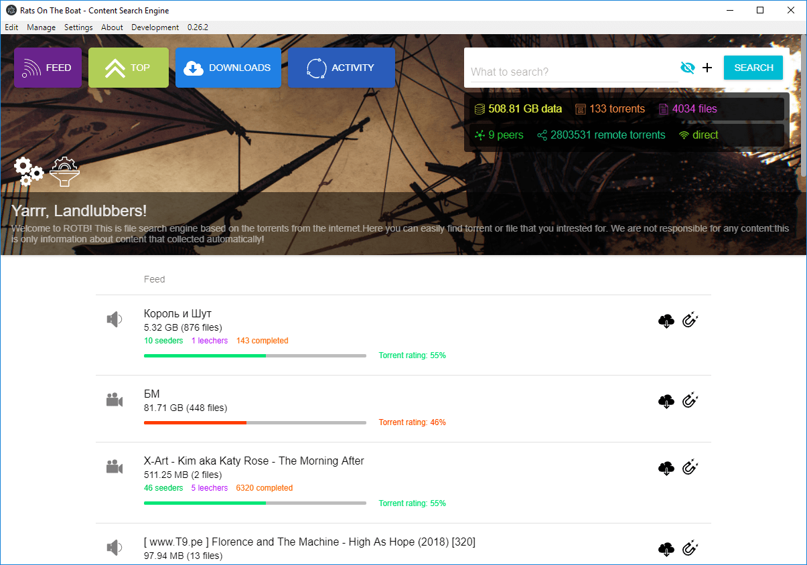
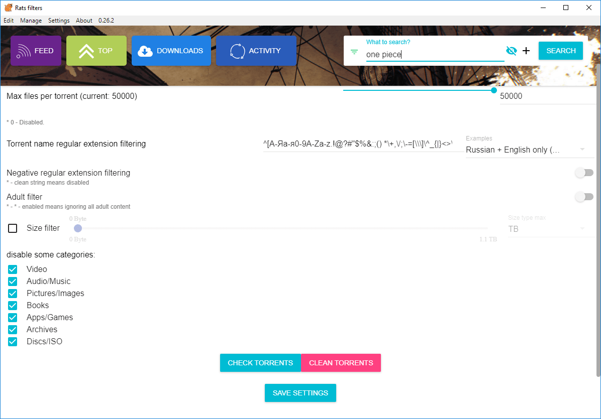

## Использование

После инсталляции программы и запуска вам должно быть доступно основное окно программы:

Программа открывается на вкладке feed (лента). Здесь собраны наиболее актуальные торренты, с которыми были произведены какие-либо действия за последнее время (лайки, комментарии и т.п.). Если лента пуста, нужно просто дождаться синхронизации ее с любого из доступных пиров (о них ниже). 

Изначально у вас нету базы поиска. Можно использовать готовые базы поиска, предварительно скопировав их в папку с настройками, либо дождаться накопления своей базы до достаточного размера, что будет проиходить автоматически при корректных настройках. Либо попросту использовать [распределенный поиск](#Распределенный-поиск).  

Сбор новых торрентов из сети должен начаться автоматически через минуту-две после запуска программы (в случае корректно открытых портов). 
Это можно отслеживать в поле с торрентами под поиском, а так же в списке поступления торрентов во вкладке activity (активность). 

Скорость сбора торрентов будет увеличиваться с течением времени работы программы. Подробнее о настройке сканера описано в пункте с [настройкой сканера торрентов](#Настройка-сканнера-торрентов).

В случае, если сбор торрентов не происходит, или идет очень-очень медленно (по 1-2 торренту в несколько минут), следует удостовериться что открыты порты, указанные в настройках. Об этом в следующем пункте.

### Настройка портов

Для корректной работы, необходимо чтобы были открыты порты 4445 и 4446 (или другие, указанные в настройках). Должны быть открыты оба типа портов (UDP и TCP). На роутере порты обязательно должны быть проброшены через NAT (если таковой включен). В случае, если ваш роутер поддерживает UPnP, порты будут проброшены автоматически и, в принципе, делать ничего не нужно.

### Использование поиска

С течением времени ваша база торрентов естественным путем будет расти, и вы можете искать интересующий вас торрент, используя поиск в шапке.

### Распределенный поиск

В случае нахождения других клиентов ROTB, о чем сигнализирует индикатор в верхней части

вам будет доступен расширенный поиск среди других клиентов ROTB, для этого вам нужно выполнить обычный поиск, однако будут отображены дополнительные результаты выдачи. Результат расширенной выдачи может изменяться в зависимости от количества пиров и именно тех, кого нашло.

Результаты выдачи других участников помечаются отдельным цветом.

### Настройка сканнера торрентов

В настройках есть 3 параметра, отвечающих за настройку поиска торрентов в сети, каждый из них влияет на нагрузку приложения, скорость сбора торрентов, генерацию траффика, а так же на общую нагрузку на оборудование промежуточных узлов сети (роутера и т.п.)

Рекомендованные значения:
* Максимально быстрый поиск / высокая нагрузка:
  * Скорость прохода: 5
  * Использование узлов: 0 (отключен = максимальное использование)
  * Сократить количество сетевых пакетов: 0 (отключено = неограниченно)
* Средняя скорость поиска / средняя нагрузка:
  * Скорость прохода: 15
  * Использование узлов: 100
  * Сократить количество сетевых пакетов: 600
* Низкая скорость поиска / средняя нагрузка:
  * Скорость прохода: 30
  * Использование узлов: 10
  * Сократить количество сетевых пакетов: 450

### Настройка фильтров торрентов

В некоторых случаях вас могут не интересовать торренты определенного типа, размера или языка, и вы хотите чтобы сканер их игнорировал, а ваша база их не сохраняла. Для этого используется отдельное окно настроек фильтров торрентов.

Для этого нужно выбрать соотвествующие настройки и сохранить их. После этого в зависимости от надобности можно проверить и очистить базу в соостветствии с новыми настройками.